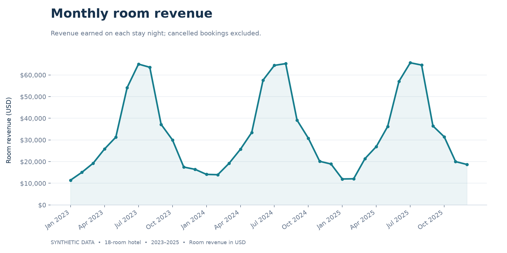
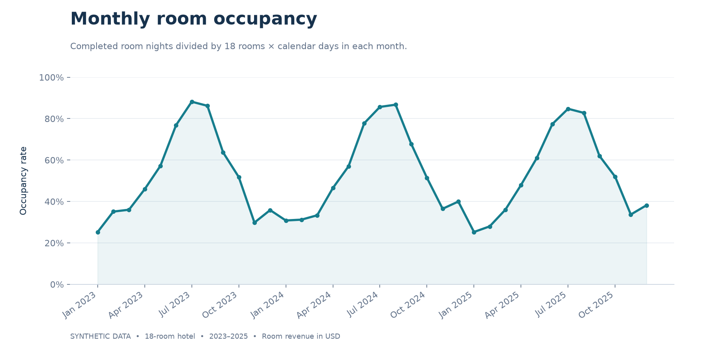
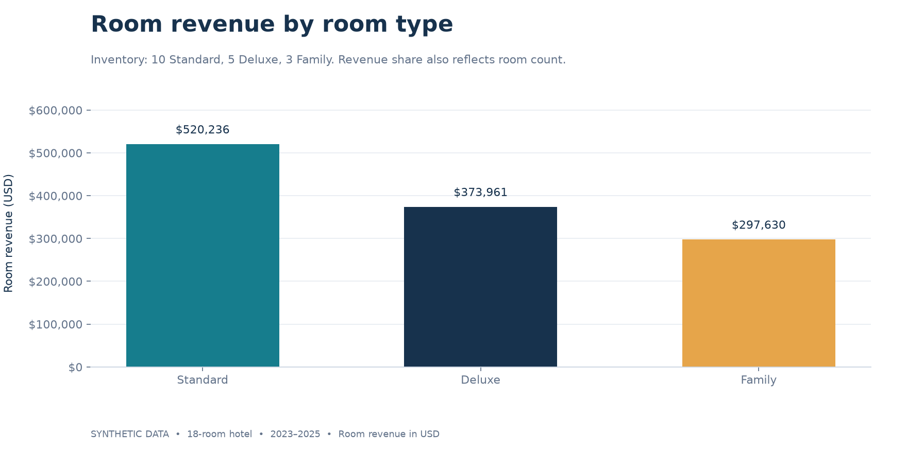
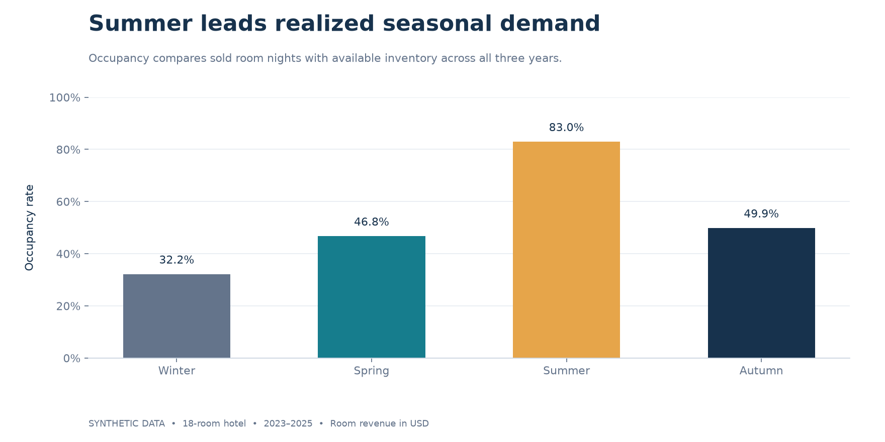
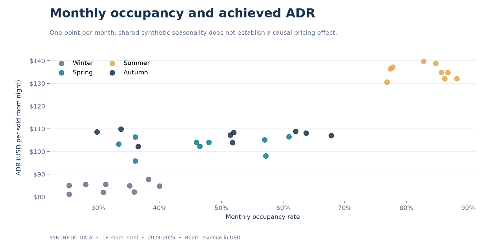

# Hotel Revenue & Booking Analytics

**A reproducible Python portfolio project exploring revenue, occupancy, seasonality and pricing for a synthetic 18-room hotel.**

> This is a portfolio reconstruction based on analytical workflows used in a real hospitality setting. All data in this repository is synthetic and does not contain customer or proprietary business information.



## Overview

This project reconstructs the type of booking and revenue analysis I performed as a Data Specialist / Data and Business Analyst in a small hospitality business. The original business data and analytical code are unavailable. The code, dataset and findings here were created for this portfolio; they do not reproduce historical company results or claim measured business impact.

The workflow turns a deliberately imperfect synthetic booking export into validated records, nightly revenue, interpretable KPIs and practical pricing hypotheses. It demonstrates Python, pandas, NumPy, data cleaning, exploratory analysis and communication of business findings.

**Start with:** [the executed notebook](notebooks/hotel_revenue_analysis.ipynb), [key insights](#key-insights), or [the analysis entry point](src/run_analysis.py).

## Business Questions

- When is realized demand strongest, and how consistent is the seasonal pattern?
- Which room types generate the most revenue, and how does their inventory affect that comparison?
- How do ADR and occupancy change across months and seasons?
- How do booking lead times, cancellations and channels vary?
- Which periods warrant testing higher rates or targeted promotions?

## Dataset

The reporting window covers **1 January 2023 through 31 December 2025**. The fictional hotel has **18 rooms: 10 Standard, 5 Deluxe and 3 Family**. Every room is available every night, including leap day in 2024: **1,096 days × 18 rooms = 19,728 available room nights**. Currency is illustrative **USD**.

| Field | Meaning |
|:--|:--|
| `booking_id` | Artificial `SYN-B…` identifier; one booking reserves one room |
| `booking_date` | Creation date; may precede 2023 for early arrivals |
| `check_in`, `check_out` | Arrival and exclusive departure dates |
| `room_id`, `room_type` | Artificial inventory identifier and Standard / Deluxe / Family category |
| `guests` | Party size within room capacity; some values deliberately missing |
| `nights` | Length of stay, recomputed from departure minus arrival |
| `room_rate` | Fixed nightly room price for the entire stay, in USD |
| `revenue` | Rate × nights for completed stays; zero for cancellations |
| `booking_channel` | Direct, Online travel agency or Travel agent; generic labels only |
| `booking_status` | Completed or Cancelled |
| `lead_time` | Days between booking creation and arrival |
| `month`, `season`, `weekday`, `is_weekend` | Arrival-based fields added during cleaning |

### How the simulation works

[The generator](src/generate_synthetic_data.py) uses NumPy's random generator with **seed 42**. Each available room receives a daily chance of a potential arrival, with stronger summer and Friday/Saturday demand, lower winter demand, and a summer preference for Family rooms. Completed stays block that room until checkout, preventing overbooking.

Stay lengths use a bounded Poisson-based distribution; lead times use a bounded lognormal distribution. Rates start at $75 / $110 / $145 by room type, then vary with season, arrival weekend, modest annual increases, advance-booking discounts and small random variation. Generic channels have different cancellation probabilities. Cancelled bookings are assumed to cancel before arrival and never block inventory; fees are zero.

An independent **seed 43** adds about 1% duplicate rows, 1% missing guest counts, inconsistent category casing/whitespace, and incorrect derived values. The raw file intentionally contains these issues. Cleaning produces [a separate validated dataset](data/cleaned_bookings.csv) and [an audit report](reports/data_quality.json). No downloaded or private dataset is used.

### Assumptions and limits

- Each booking is one room; guest counts are not used to estimate occupancy. Missing guest counts remain unknown.
- All stays lie within the reporting window. Late-December stays are shortened at the end of 2025, creating a small boundary effect; the simulation starts without carry-in stays.
- Room revenue excludes taxes, meals, commissions, operating costs, refunds and cancellation fees. It is **not profit**.
- The hotel has no closures, maintenance blocks, no-shows, group bookings or overbooking. Cancellation timestamps and rebooking behavior are not modeled.
- Sold room nights measure **realized demand**. Search traffic, rejected requests and unconstrained demand are unavailable.
- Demand and rates share programmed seasonal drivers. Observed correlations demonstrate analytical techniques; they cannot establish price elasticity or an optimal price.
- Friday and Saturday **stay nights** count as weekends. Calendar seasons follow a northern-hemisphere convention: winter Dec–Feb, spring Mar–May, summer Jun–Aug, autumn Sep–Nov.

## KPIs

| KPI | Definition and denominator |
|:--|:--|
| Room revenue | Sum of fixed nightly rates across completed stay nights |
| ADR | Completed room revenue ÷ completed room nights; never an unweighted average of booking rates |
| Occupancy | Completed room nights ÷ available room nights in the same period and room type |
| RevPAR | Room revenue ÷ available room nights; combines occupancy and ADR |
| Booking volume | Unique bookings, with completed and cancelled counts shown separately |
| Room nights | Sum of nights for completed bookings |
| Average length of stay | Completed room nights ÷ completed bookings |
| Cancellation rate | Cancelled unique bookings ÷ all unique bookings |
| Average lead time | Mean days from creation to arrival for completed bookings |

**Date alignment matters:** revenue, ADR and occupancy use the actual **stay date**. Monthly booking counts use **check-in month** and include cancelled bookings separately. A stay from 31 January to 2 February contributes one room night to January and one to February. Booking-creation-month counts are provided in a separate report; boundary months are incomplete because the dataset is selected by stay dates.

## Analysis

1. **Generate:** simulate three years of bookings with physical room capacity and controlled export issues.
2. **Clean:** normalize categories, remove exact duplicates, validate identifiers/dates/rates/guest counts, and rebuild nights, revenue and lead time. Conflicting IDs or invalid source fields raise errors instead of silently disappearing.
3. **Reshape:** expand completed bookings into room nights and join a full daily inventory calendar, including zero-sale dates.
4. **Analyze:** summarize monthly KPIs, room-type revenue share and RevPAR, calendar-month seasonality, weekdays/weekends, channel cancellation rates, and lead-time/price relationships.
5. **Communicate:** save tidy CSV tables, ten charts and dataset-derived findings. Recommendations are hypotheses for small, monitored tests; no automated pricing model is used.

## Key Insights

This section is refreshed automatically by `python -m src.run_analysis` from the validated data. These findings describe the simulation, not historical results from a real hotel.

<!-- RESULTS:START -->

Results for **1 January 2023–31 December 2025**, generated with seed `42`.

| Metric | Result |
|:--|--:|
| Room revenue | $1,191,827.13 |
| Unique bookings / completed / cancelled | 4,226 / 3,655 / 571 |
| Completed room nights | 10,468 |
| Available room nights | 19,728 |
| ADR | $113.85 |
| Occupancy | 53.1% |
| RevPAR | $60.41 |
| Average completed stay | 2.86 nights |
| Cancellation rate | 13.5% |
| Average lead time, completed bookings | 26.6 days |

- 2025-07 generated the most monthly room revenue ($65,628.32). Revenue is allocated by stay night, including stays crossing month-end.

- Summer had the highest occupancy (83.0%) at $135.17 ADR; Winter had the lowest (32.2%) at $84.41 ADR.

- Standard rooms generated 43.7% of room revenue ($520,235.58). Compare their 53.6% occupancy and $47.47 RevPAR alongside revenue share because room counts differ.

- 13.5% of unique bookings were cancelled. Completed stays averaged 2.86 nights and were booked 26.6 days ahead.

- Pricing hypothesis: with summer occupancy at 83.0%, test a small rate increase on selected busy dates and monitor conversion, cancellations and RevPAR. The data does not estimate an optimal price or uplift.

- Promotion hypothesis: winter occupancy of 32.2% suggests testing targeted packages on weak dates. Evaluate incremental room nights and net revenue after discount and channel costs, which are not modeled here.

- Monthly occupancy and ADR have a Pearson correlation of 0.90. Both share an explicitly programmed seasonal pattern; this is descriptive and cannot show that raising prices causes stronger demand.

Cleaning audit: 4,268 raw rows → 4,226 unique bookings; 42 duplicate rows removed and 42 missing guest counts retained as unknown. See [the full quality report](reports/data_quality.json) for repaired derived values.

<!-- RESULTS:END -->

## Visualisations






The [figures folder](figures/) also contains monthly ADR, monthly booking volume, room-type ADR, booking lead-time distribution and lead time versus ADR. Every chart carries a synthetic-data label and explicit units.

## Technologies

- **Python**, **pandas**, **NumPy**: simulation, validation, aggregation and descriptive analysis.
- **matplotlib**: publication-ready PNG charts.
- **Jupyter notebook**, **nbformat**, **nbclient**, **ipykernel**: an executed, reproducible walkthrough.
- **unittest**: checks for accounting reconciliation, date boundaries, capacity, cleaning and reproducibility.

## Repository Structure

```text
hotel-revenue-analytics/
├── README.md
├── requirements.txt
├── requirements-notebook.txt
├── .gitignore
├── data/
│   ├── synthetic_bookings.csv       # Raw synthetic export with deliberate issues
│   └── cleaned_bookings.csv         # Unique, validated synthetic bookings
├── src/
│   ├── config.py                    # Reporting window, seed and fictional inventory
│   ├── generate_synthetic_data.py
│   ├── clean_data.py
│   ├── kpi_analysis.py
│   ├── seasonality_analysis.py
│   ├── pricing_analysis.py
│   ├── visualizations.py
│   └── run_analysis.py              # Full reproducible workflow
├── notebooks/
│   └── hotel_revenue_analysis.ipynb # Executed narrative and outputs
├── scripts/
│   └── execute_notebook.py
├── reports/                        # CSV tables, KPIs, cleaning audit and findings
├── figures/                        # Ten generated PNG charts
└── tests/
    └── test_analysis.py
```

## Running the Project

Use **Python 3.13** (the tested environment). From a terminal:

```bash
git clone https://github.com/devitne9/hotel-revenue-analytics.git
cd hotel-revenue-analytics
python -m venv .venv
source .venv/bin/activate
# Windows PowerShell: .venv\Scripts\Activate.ps1
python -m pip install -r requirements.txt
python -m src.run_analysis
python -m unittest discover -s tests -v
```

The pipeline rebuilds the synthetic CSVs, tables, chart images and the generated results section of this README. It uses project-relative paths and never reads external business data. Run module commands from the repository root. Direct dependencies are pinned to the versions used to generate the committed outputs.

To re-execute the notebook and save fresh outputs:

```bash
python -m pip install -r requirements-notebook.txt
python scripts/execute_notebook.py
```

Open the notebook in GitHub to read its saved results, or select the `.venv` Python interpreter in a local notebook editor. The notebook works when started from the repository root or the `notebooks` directory. Re-executing it refreshes the charts; the full pipeline also refreshes CSV/JSON reports and README findings.

## Privacy

> This repository contains no real customer, reservation, Booking.com, or business data. All data is synthetically generated for portfolio and demonstration purposes.

All identifiers are artificial and use a `SYN-` prefix. The project has no customer names, emails, phone numbers, addresses, real property identifiers, credentials, API keys, private integration code or original business records. All simulation parameters are illustrative assumptions.
